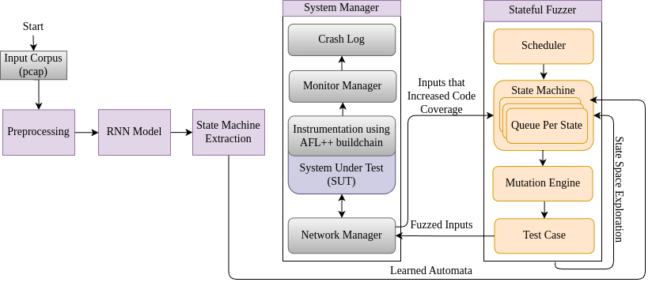

#  RNN-MCFICS: A Coverage-Guided Greybox Fuzzer Based on Automated State Machine Extraction for Industrial Control System Protocols
### Design
Preview of the design:



### Preresiquite
**System:**
```bash
sudo apt-get update && sudo apt get install python3 python3-pip python3-venv libpcap-dev libpq-dev graphviz-dev clang
```
*Additionally: * MCFICS requires afl-gcc or afl-clang to build target for instrumentation and collecting code coverage. To install the program yourself you need to following the depencies and afl instrumentation guide provided by [AFL++](https://github.com/AFLplusplus/AFLplusplus)
## Installation (Tested on Ubuntu 22.04 & 20.04 & 18.04 & 16.04)
1. Install [AFL++](https://github.com/AFLplusplus/AFLplusplus)
2. Install MCFICS
```bash
git clone --recursive <the-current-repo> # clone
cd rnn_mcfics            # workdir
python3 -m venv env                     # Creat virtual environment
source env/bin/activate                 # Activate virtual environment 
pip install -r requirements.txt         # Install other libraries
```
You should have a working version of both afl++ and MCFICS
We need to compile the [lib60870](https://github.com/mz-automation/lib60870) which you can clone to any repo path
```bash
cd <path-to-the-lib>/lib60870/lib60870-C/
```
**Prepare Instrumentation**
We will replace the C compiler with AFL++ toolchain compiler, you can use afl-clang, afl-clang-fast, afl-gcc or afl-gcc-fast to compile the code
```bash
echo "CC=<path-to-afl>/afl-clang-fast" >> make/target_system.mk                     # Use afl-clang-fast to compile the code
echo "CFLAGS += -fsanitize=address,undefined" >> make/target_system.mk                        # Add address sanitizer
make -j<N CPU>
```
You now have a working instrumentation, next step is to compile the test harness.

**Test Harness**
```bash
cd examples/cs104_server_no_threads
make -j<N CPU>
```
This gives a compiled server example, we have a precombined server in the FMI/c_SUT folder.
## Usage

```bash
python -m FMI --help

usage: __main__.py [-h] [-pj PROJECT] [-hs HOST] [-p PORT] [-pt {tcp,udp,tcp+tls}]
                   [-st SEND_TIMEOUT] [-rt RECV_TIMEOUT] --fuzzer {MIFuzzer}
                   [--name NAME] [--debug] --pcap PCAP [--seed SEED]
                   [--budget TIME_BUDGET] [--output OUTPUT] [--shm_id SHM_ID]
                   [--dump_shm] [--restart module_name [args ...]]
                   [--restart-sleep RESTART_SLEEP_TIME]
 Industrial Control Fuzzing Approach by Uchenna Ezeobi

optional arguments:
  -h, --help            show this help message and exit
  -pj PROJECT, --project PROJECT
                        project to create
  -hs HOST, --host HOST
                        target host
  -p PORT, --port PORT  target port

Connection options:
  -pt {tcp,udp,tcp+tls}, --protocol {tcp,udp,tcp+tls}
                        transport protocol
  -st SEND_TIMEOUT, --send_timeout SEND_TIMEOUT
                        send() timeout
  -rt RECV_TIMEOUT, --recv_timeout RECV_TIMEOUT
                        recv() timeout

Fuzzer options:
  --fuzzer {MIFuzzer}   application layer fuzzer
  --name NAME           Name of the protocol you are fuzzing
  --debug               enable debug.csv
  --pcap PCAP           example communicaion between client and server
  --seed SEED           prng seed
  --budget TIME_BUDGET  time budget
  --output OUTPUT       output dir
  --shm_id SHM_ID       custom shared memory id overwrite
  --dump_shm            dump shm after run

Restart options:
  --restart module_name [args ...]
                        Restarter Modules:
                          afl_fork: '<executable> [<argument> ...]' (Pass command and arguments within quotes, as only one argument)
  --restart-sleep RESTART_SLEEP_TIME
                        Set sleep seconds after a crash before continue (Default 5)

```
**Run the example server for IEC104**
```bash
cd <path-mcfics>
python -m FMI -pj new_project -hs 127.0.0.1 -p 2404 -pt tcp --fuzzer MIFuzzer --name iec104 --pcap FMI/data/iec104/combined.pcap --seed 123456 --restart afl_fork "./FMI/c_SUT/cs104_server_no_threads"  --budget 10000000
```

## Paper Published from this Repo

* MCFICS: Model-based Coverage-guided Fuzzing for Industrial Control System Protocol Implementations

* ALF: Automata Learning Fuzzer for Industrial Control System Protocol Implementations

## Acknowledgement 
We would like to the following code repository, this project will not be possible with this code base.

* An Active Automata Learning Library: [AALPY](https://github.com/DES-Lab/AALpy)
* Evolutionary Protocol Fuzzer: [EPF](https://github.com/fkie-cad/epf)
* Network Protocol Fuzzing for Humans [BooFuzz](https://github.com/jtpereyda/boofuzz)
* Coverage-guided parallel fuzzer [Manul](https://github.com/mxmssh/manul)
* Protocol Reverse Engineering, Modeling and Fuzzing [Netzob](https://github.com/netzob/netzob/tree/master)
## Owner of Repo 

* **Uchenna Ezeobi** (uezeobi@uccs.edu, uchenna.ezeobi3@gmail.com)
* **Dr. Gedare Bloom** (gbloom@uccs.edu)

